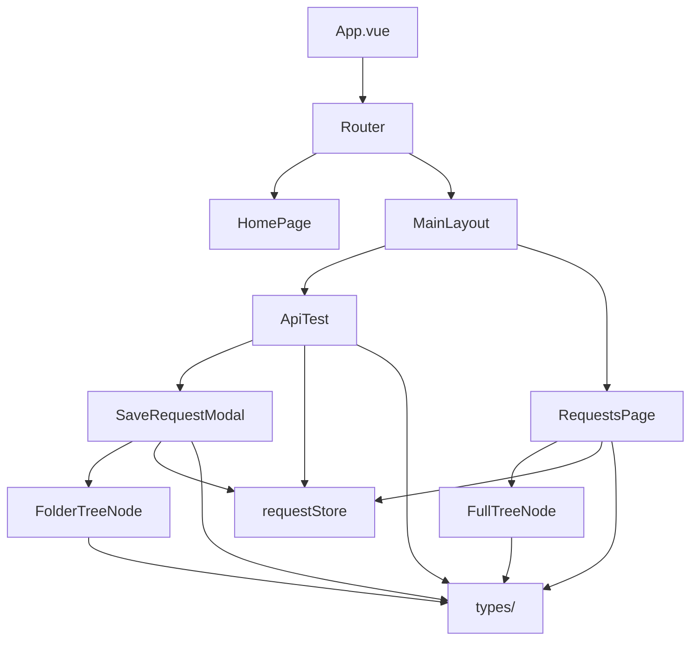

# Barrage 前端项目结构一览

```
barrage-page/
│
├── 📦 public/                  # 公共静态资源
│
├── 📁 src/                     # 源代码目录
│   │
│   ├── 🎨 assets/              # 静态资源（待添加）
│   │
│   ├── 🧩 components/          # 可复用组件
│   │   ├── 📂 common/          # 通用组件
│   │   │   └── SaveRequestModal.vue    [保存请求弹窗]
│   │   ├── 📂 tree/            # 树形组件
│   │   │   ├── FolderTreeNode.vue      [文件夹树节点-递归]
│   │   │   └── FullTreeNode.vue        [完整树节点-递归]
│   │   └── 📂 simulate/        # 模拟测试组件
│   │       └── NodeConfigModal.vue     [节点配置弹窗]
│   │
│   ├── 📄 views/               # 页面组件
│   │   ├── 📂 home/            # 首页模块
│   │   │   └── HomePage.vue            [启动页面+粒子特效]
│   │   ├── 📂 main/            # 主界面模块
│   │   │   ├── MainLayout.vue          [主布局+导航栏]
│   │   │   └── RequestsPage.vue        [请求管理页面]
│   │   └── 📂 test/            # 测试模块
│   │       ├── ApiTest.vue             [接口测试页面]
│   │       └── SimulateTestPage.vue    [模拟测试图形化配置页面]
│   │
│   ├── 🛣️ router/              # 路由配置
│   │   └── index.ts                    [路由定义 / 和 /main]
│   │
│   ├── 💾 stores/              # 状态管理
│   │   ├── requestStore.ts             [请求树全局状态-单例]
│   │   └── simulateStore.ts            [模拟测试工作流图状态]
│   │
│   ├── 📝 types/               # TypeScript 类型
│   │   ├── index.ts                    [全局类型定义]
│   │   └── simulate.ts                 [模拟测试类型定义]
│   │
│   ├── 🔧 utils/               # 工具函数（待添加）
│   │
│   ├── App.vue                 # 根组件
│   ├── main.ts                 # 入口文件
│   └── style.css               # 全局样式
│
├── package.json                # 依赖配置
├── vite.config.ts              # Vite 配置
├── tailwind.config.js          # Tailwind 配置
├── tsconfig.json               # TypeScript 配置
└── PROJECT_STRUCTURE.md        # 本文档
```

## 文件数量统计

| 类型 | 数量 | 说明 |
|------|------|------|
| 页面组件 | 5 | HomePage, MainLayout, RequestsPage, ApiTest, SimulateTestPage |
| 可复用组件 | 4 | SaveRequestModal, FolderTreeNode, FullTreeNode, NodeConfigModal |
| 状态管理 | 2 | requestStore, simulateStore |
| 路由配置 | 1 | router/index.ts |
| 类型定义 | 2 | types/index.ts, types/simulate.ts |
| **总计** | **14** | **核心源文件** |

## 模块依赖关系



## 组件层级

```
Level 0: App.vue
    ├─ Level 1: HomePage
    └─ Level 1: MainLayout
        ├─ Level 2: ApiTest
        │   └─ Level 3: SaveRequestModal
        │       └─ Level 4: FolderTreeNode (递归)
        └─ Level 2: RequestsPage
            └─ Level 3: FullTreeNode (递归)
```

## 重构成果 ✅

### 之前的结构
```
src/
└── components/
    ├── HomePage.vue
    ├── MainLayout.vue
    ├── ApiTest.vue
    ├── RequestsPage.vue
    ├── SaveRequestModal.vue
    ├── FolderTreeNode.vue
    └── FullTreeNode.vue
```
❌ 所有文件混在一起，难以维护

### 重构后的结构
```
src/
├── components/         # 可复用组件
│   ├── common/
│   └── tree/
├── views/              # 页面组件
│   ├── home/
│   ├── main/
│   └── test/
├── types/              # 类型定义
└── stores/             # 状态管理
```
✅ 清晰的职责分离，易于扩展

## 优势

1. **清晰的目录结构** - 一目了然每个文件的用途
2. **更好的可维护性** - 相关文件组织在一起
3. **类型安全** - 统一的类型定义
4. **易于扩展** - 新功能有明确的放置位置
5. **团队协作友好** - 降低学习成本

## 下一步建议

- [ ] 添加单元测试 (`tests/` 目录)
- [ ] 添加工具函数 (`utils/` 目录)
- [ ] 添加常量定义 (`constants/` 目录)
- [ ] 添加 API 封装 (`api/` 目录)
- [ ] 添加组件文档 (Storybook)
